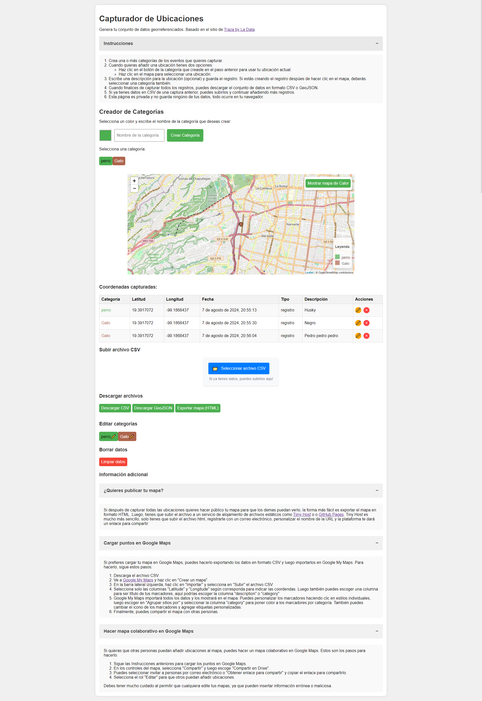

# capture-locations

This is a project to test the coding abilities of LLM models like GPT, Claude, and Gemini.

I'm aiming to replicate and enhance the functionality of the impressive ["Traza"](https://www.ladata.mx/traza/) website by La Data, which I find it to be intelligent, practical, and straightforward.

Check the generated page using Claude Sonet 3.5 at https://jjsantos01.github.io/capture-locations/

## Rendered page
